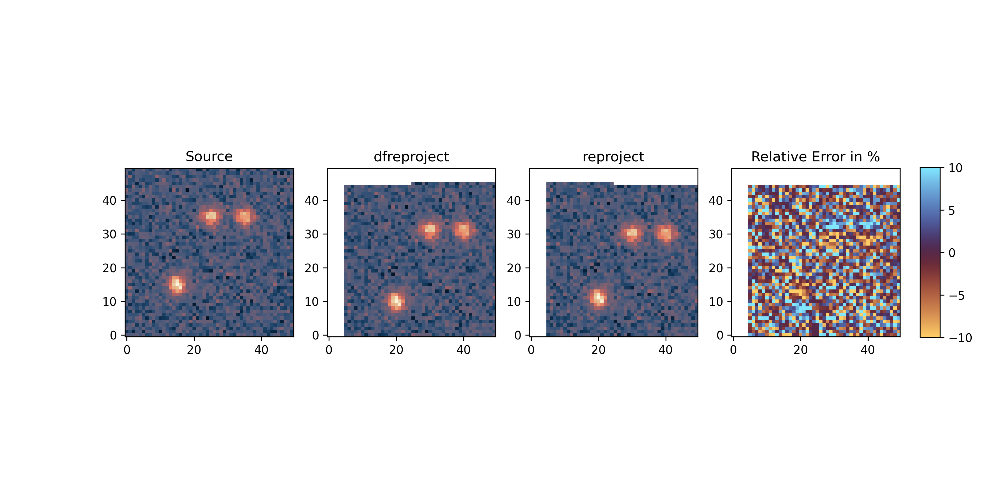
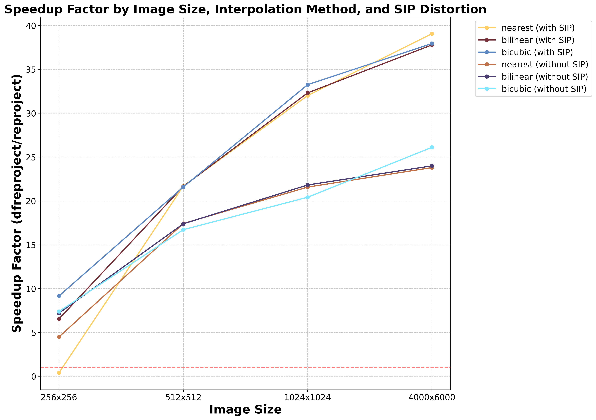
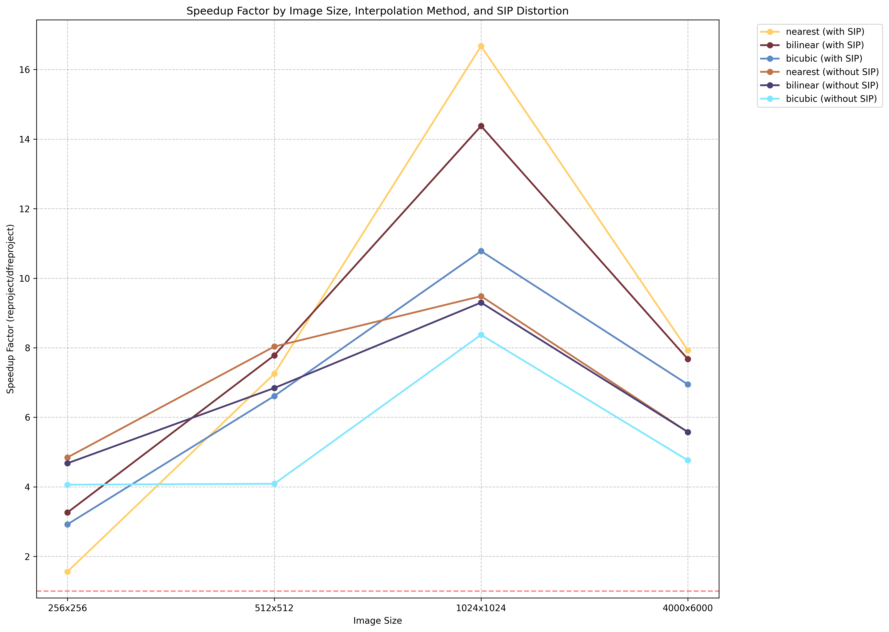

# Summary
Deep astronomical images are often constructed by digitially stacking many individual sub-exposures. Each sub-exposure is expected to show small differences in the positions of stars and other objects in the field, due to the movement of the celestial bodies, changes/imperfections in the opto-mechanical imaging train, and other factors.
To maximize image quality, one must ensure that each sub-exposure is aligned to a common frame of reference prior to stacking. This is done by reprojecting each exposure onto a common target grid defined using a World Coordinate System (WCS) that is defined by mapping the known angular positions of reference objects to their observed spatial positions on each image. The transformations needed to reproject images involve complicated trigonometric expressions which can be slow to compute, so reprojection can be a major bottleneck in image processing pipelines.

To make astronomical reprojections faster to implement in pipelines, we have written `dfreproject`, a Python package of GPU-optimized functions for this purpose. The package's functions break down coordinate transformations using Gnomonic projections to define 
pixel-by-pixel shifts from the source to the target plane. The package also provides tools for interpolating a source image onto a target plane with a single function call.
This module follows the FITS and SIP formats laid out in the following papers: @greisen_representations_2002, @calabretta_representations_2002, and @shupe_sip_2005.
Compared to common alternatives, `dfreproject`'s routines result in speedups of up to 20X when run on a GPU and 10X when run on a CPU.

# Statement of need

Several packages already exist for calculating and applying the reprojection of a source image onto a target plane, such as 
`reproject` [@robitaille_reproject_2020] or `astroalign` [@beroiz_astroalign_2020]. These packages excel at easy-to-use, general-purpose astronomical image reprojection, but they function solely on CPUs and can be computational bottlenecks in some data reduction pipelines. The `dfreproject` package harnesses GPUs (using `PyTorch` [@paszke_pytorch_2019] as its computational backbone) to improve computational efficiency. The package has minimal reliance on pre-existing WCS packages such as those found in `astropy` or `WCSLIB` [@astropy_collaboration_astropy_2013; @astropy_collaboration_astropy_2018; @astropy_collaboration_astropy_2022], with such packages being used only for convenience in non-computationally expensive steps (such as using `astropy.wcs` to read the header information from the input fits files). 

`dfreproject`'s primary purpose is to reproject observations taken by a new version of the Dragonfly Telephoto Array that is currently under construction in Chile.
The volume of data obtained with this telescope will be large, with >1000 exposures obtained simultaneously, and it is paramount that the processing pipeline incorporates fast and accurate reprojection methods.
As shown below, by leveraging `PyTorch` for vectorization and parallelization via the GPU,
`dfreproject` achieves a considerable speedup (up to nearly 20X) over standard methods.


`dfreproject` can be used as a direct replacement for `reproject.reproject_interp` by simply importing `dfreproject` instead of `reproject` such as:
```Python 
from dfreproject import calculate_reprojection
reprojected = calculate_reprojection(
    source_hdus=source_hdu,
    target_wcs=target_wcs,
    shape_out=target_hdu.data.shape,
    order='bilinear',
   device='cpu',
   n_threads=2
)
```

The `target_wcs` argument can be passed as a header similar to `reproject.` Additionally, if `shape_out` is not provided, the shape will be the same as the input.


# Methods
We must perform three intermediate calculations to reproject an image onto a new coordinate plane. 
To do this, we use the target and source WCS. 

Before defining the steps, there are a few terms to define:

- SIP: Standard Imaging Polynomial. This convention allows us to represent non-linear geometric distortions as a simple polynomial.
The order and coefficients of this polynomial are stored in the header. The SIP is broken down into four individual polynomials, SIP\_A, SIP\_B, SIP\_INV\_A, and SIP\_INV\_B where
SIP\_A defines the polynomial applied to the x-coordinates, SIP\_B defines the polynomial applied to the y-coordinates, and SIP\_INV\_A and SIP\_INV\_B define the inverse operations.
For an in-depth discussion on SIP, please see @shupe_sip_2005.

CD Matrix: Coordinate Description Matrix. This is a 2X2 matrix that encodes the image's rotation, skew, and scaling. 
The values are conveniently stored in the header. The CD matrix may also be constructed from the PC Projection Coordinate matrix multiplied by the CDELT values.

The steps are as follows:

1. For each pixel, calculate the corresponding celestial coordinate using the target WCS

   1. Apply shift
   
   2. Apply SIP distortion

   3. Apply CD matrix
   
   4. Apply transformation to celestial coordinates using the Gnomonic projection


2. Calculate the position in the source grid for each celestial coordinate. This provides the offset for the next step.

   1. Apply the inverse transformation using the Gnomonic projection

   2. Apply inverse CD matrix

   3. Apply inverse SIP distortion

   4. Apply shift


3. Interpolate the source image onto the newly calculated grid 

In the final interpolation step, we include local flux conservation by simultaneously projecting an identity tensor called the footprint.
The final reprojected frame is normalized by this footprint.

# Results
## Demo
We created two small (50x50) FITS files for this demonstration with a pixel offset of 0.5 pixels and a 0.005 degree offset in the header.
In \autoref{fig:demo} from left to right, we show the original image, the `dfreproject` solution, the `reproject` solution, and the relative error between the two.
We define the relative error as $100 * \frac{\mathrm{dfreproject\_solution} - \mathrm{reproject\_solution}}{\mathrm{reproject\_solution}}$.
For both solutions, we use a bilinear interpolation scheme. In the noisy regions of the image, the differences in the reprojections is pure noise. 
There are slight differences in the solutions at the locations of the Gaussians which is attributable to small differences in the normalization. 
In this demo, we used the gpu by setting `device='gpu'` in the argument of `calculate_reprojection()`.




## Speed Comparison
To compare the execution times, we created a benchmarking script (which can be found in the demos/benchmarking directory under `benchmark-script.py`; the figures are constructed with `benchmark-plotter.py`).
This test is run between `dfreproject` and `reproject`.
We benchmark the three interpolation schemes with and without SIP distortion for images sized 256x256 to 4000x6000 (this approximately matches the size of Dragonfly images).
\autoref{fig:gpu-comparison} shows the results of this benchmarking when `dfreproject` is run using a GPU (NVIDIA GeForce RTX 4060).





As evidenced by this figure, `dfreproject` has a significant speed advantage over `reproject` for larger images regardless of the type of interpolation scheme. 
The speedup is most pronounced in the case where SIP distortions are included.

In \autoref{fig:cpu-comparison}, we display the same results except we used a CPU (Intel® Core™ i9-14900HX). 
For this experiment, we used a single thread.





Although the speedup on the CPU is not as impressive as on the GPU, it is still considerable.

All code can be found in the `demo` directory.

# Acknowledgements
We acknowledge the Dragonfly FRO and particularly thank Lisa Sloan for her project management skills.

We use the cmcrameri scientific color maps in our demos [@crameri_scientific_2023].

# References
